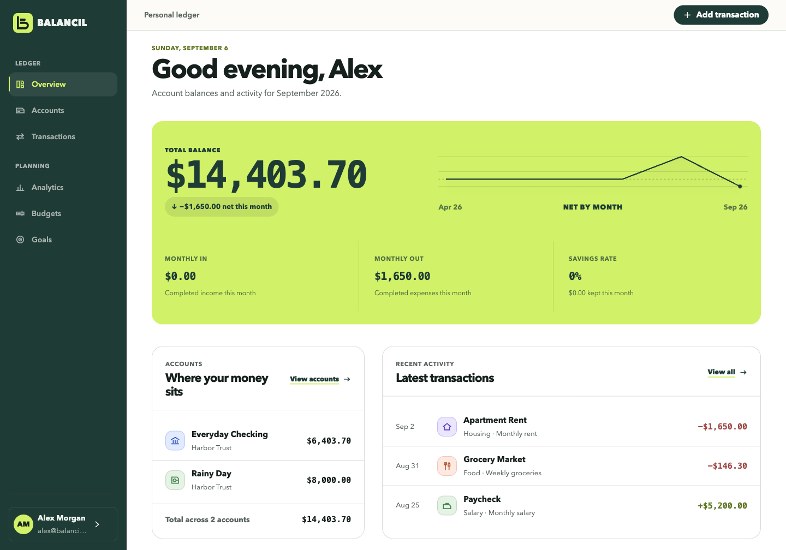
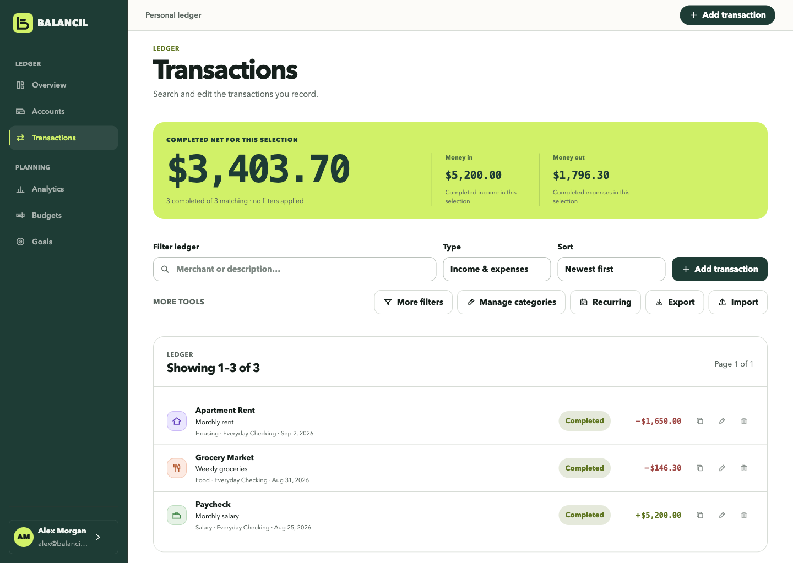
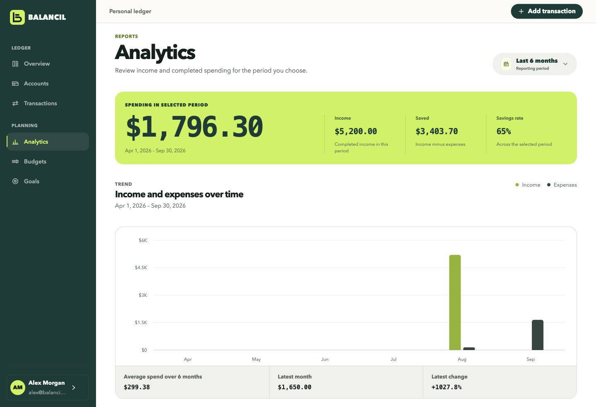

# Balancil

[](https://github.com/alexidrs79/Balancil/actions/workflows/ci.yml)

**Live app:** [https://balancil.vercel.app](https://balancil.vercel.app)  
**API:** [https://balancil-api.onrender.com](https://balancil-api.onrender.com)

Balancil is a private personal ledger: accounts, transactions, budgets, savings
goals, and spending trends. You enter the records. It does not connect to banks,
import feeds, or move money.

The React app talks to a Laravel REST API. Each account is isolated. Sessions use
Sanctum bearer tokens.

> The Render API sleeps on the free plan. The first request after idle can take
> about a minute. Create your own account on the live demo — do not use any
> local seed user.



Every figure in these screenshots comes from the local demo seed described below,
not from a real ledger.

| Ledger                                          | Analytics                                 |
| ----------------------------------------------- | ----------------------------------------- |
|  |  |

## What it is (and is not)

- Manual accounts and transactions. No Plaid, open banking, or live balances.
- Completed transactions update account balances, budgets, dashboard, and analytics.
  Pending and failed rows do not.
- Display currency is a label only. Balancil does not convert amounts.
- The landing-page product shot is a labelled sample, not a signed-in ledger.
- “Remember me” is off by default. When enabled, it stores a 30-day token in
  `localStorage`; otherwise the 12-hour token stays in `sessionStorage`. Browser
  storage is XSS-sensitive, so the frontend also ships a restrictive script policy.

## Stack

- React 19, TypeScript, Vite, React Router
- TanStack Query and Axios
- React Hook Form, Zod, Recharts
- Laravel 13, Sanctum bearer tokens, SQLite locally / Postgres on Render
- Vitest, Testing Library, PHPUnit
- Hiring demo: Vite on Vercel, Laravel Docker API on Render

## Run it locally

You need **two processes**: the Laravel API on port 8000, and the Vite app on port 5173. If only the app is running, the page loads but sign-in fails.

### Requirements

- Node.js 22 or newer
- PHP 8.3 or newer, with the SQLite extension
- Composer

On macOS with Homebrew: `brew install node php composer`. Confirm SQLite with `php -m | grep -i sqlite`.

### First-time setup

From the project root:

```bash
npm install

cd backend
composer install
cp .env.example .env
php artisan key:generate
touch database/database.sqlite
php artisan migrate
```

Do **not** seed on a machine that will be exposed. `php artisan db:seed` creates a
local-only demo user (`alex@balancil.app` / `balancil123`) and is skipped unless
`APP_ENV=local`.

### Every time you develop

Open **two terminals**.

Terminal 1 — API:

```bash
cd backend
php artisan serve --host=127.0.0.1 --port=8000
```

Leave this running. You should see `http://127.0.0.1:8000`.

Terminal 2 — app:

```bash
npm run dev
```

Open **http://localhost:5173**. Vite proxies `/api` to the Laravel server. Keep `FRONTEND_URL=http://localhost:5173` in `backend/.env` so CORS and password-reset links match. If Vite picks another port, change `FRONTEND_URL` to that origin and restart `php artisan serve`.

Create an account from **Create an account**, or use the demo user if you seeded.

To stop: Ctrl+C in both terminals.

### If sign-in fails

The app can still open while the API is down. Start `php artisan serve` first, then reload the tab. Local mail uses the log driver: password-reset links are written to `backend/storage/logs/laravel.log`.

Newly registered users get default categories and a USD display currency, and no accounts or history.

A production build should set `VITE_API_URL` to the public API origin and `VITE_SITE_URL` to the public site origin. Leave those unset for local Vite.

## Data behavior

- Accounts with transaction history cannot be deleted. Mark them inactive, or
  remove the transactions first.
- Categories used by transactions or budgets cannot be deleted.
- Budget spending is completed expenses in the budget’s current period.
- Dashboard and analytics are computed by the API.
- `GET /api/transactions` is paginated (`page`, `perPage`, max 100) and does its own
  filtering, search, and sorting. Each response carries `meta` for the pager and a
  `summary` covering the whole filtered ledger, not just the page on screen. The
  client never downloads the full ledger to filter it.
- Records are scoped to their owner by a global query scope that is fail-closed: with
  no authenticated user a query returns nothing. Console and queue code that spans
  users opts out explicitly.
- Transactions import and export as CSV. Export writes whatever the current filters
  describe. Import is two steps: a preview reports every problem and every row already
  in the ledger, and nothing is written until it is confirmed. A file with any bad row
  is refused outright rather than half-loaded, and rows already present are skipped so
  re-importing the same file cannot double a balance.
- An account records its opening balance independently of its current one, so
  `php artisan ledger:reconcile` can check every stored balance against the
  transactions and transfers behind it.
- Settings can delete the entire Balancil account and its ledger rows.

## Hiring demo deploy (Vercel + Render)

Two hosts: **Vite frontend on Vercel**, **Laravel API on Render**. Do not put
Laravel on Vercel. Do not rewrite the API in Node. Do not use ephemeral SQLite
on free Render (the disk is wiped). Use Render Postgres.

Signup email verification is **not** enabled — register works without a mail
domain. With `MAIL_MAILER=log`, password-reset emails will not send (fine for
the demo; document that limitation). Never run `db:seed` on the public host.

### Dashboard order (paste URLs into the other host)

1. **Render — Postgres**  
   Create a PostgreSQL database. Copy the **External Database URL** (or Internal
   URL if the web service is in the same region). You will paste it as
   `DATABASE_URL` on the API service.

2. **Render — Web service (API first)**  
   - Runtime: **Docker**  
   - Root Directory: `backend`  
   - Dockerfile Path: `./Dockerfile`  
   - Health Check Path: `/up`  
   - Pre-Deploy / release command: `php artisan migrate --force --no-interaction`  
     (no `db:seed`)  
   - Generate a fresh key locally (do not reuse a laptop key):

     ```bash
     cd backend && php artisan key:generate --show
     ```

   Set these env vars on the web service:

   | Key | Value |
   | --- | --- |
   | `APP_NAME` | `Balancil` |
   | `APP_ENV` | `production` |
   | `APP_DEBUG` | `false` |
   | `APP_KEY` | output of `key:generate --show` |
   | `APP_URL` | `https://<your-api>.onrender.com` (no trailing slash) |
   | `FRONTEND_URL` | temporary placeholder `https://localhost` until Vercel exists, then update |
   | `TRUSTED_PROXIES` | `*` (Render’s load balancer; required for HTTPS) |
   | `DB_CONNECTION` | `pgsql` |
   | `DB_SSLMODE` | `require` |
   | `DATABASE_URL` | Render Postgres URL (entrypoint also maps this to `DB_URL`) |
   | `SESSION_DRIVER` | `database` |
   | `SESSION_SECURE_COOKIE` | `true` |
   | `CACHE_STORE` | `database` |
   | `QUEUE_CONNECTION` | `database` |
   | `MAIL_MAILER` | `log` |
   | `MAIL_FROM_ADDRESS` | `noreply@balancil.app` |
   | `SKIP_MIGRATE` | `1` if Pre-Deploy already runs migrate (avoids double migrate) |

   Never set `FRONTEND_URL=*`. CORS allows only that one origin.

   Deploy, then confirm:

   - `GET https://<api>.onrender.com/up` → healthy  
   - `GET https://<api>.onrender.com/` → `{"ok":true,"name":"Balancil"}`

3. **Vercel — Frontend**  
   - Framework Preset: **Vite**  
   - Root Directory: `.` (repo root)  
   - Build Command: `npm run build`  
   - Output Directory: `dist`  
   - Node.js: **22.x** (`package.json` engines + Vercel project setting)  
   - SPA fallback is in `vercel.json` (rewrites → `index.html`)

   Build env:

   | Key | Value |
   | --- | --- |
   | `VITE_SITE_URL` | `https://balancil.vercel.app` (no trailing slash) |
   | `VITE_API_URL` | `https://balancil-api.onrender.com/api` |

4. **Back to Render**  
   Set `FRONTEND_URL` to the real Vercel origin (no trailing slash) and
   **redeploy the API** so CORS and password-reset links match. If the Vercel
   URL changes again, update `FRONTEND_URL` and redeploy the API.

5. **Smoke (real register, no seed)**  
   register → add account → add transaction → see it on overview → sign out →
   sign in. Skip forgot-password while `MAIL_MAILER=log`. Do **not** seed the
   demo-user password on the public host.

### Scheduler on the free demo

`routes/console.php` schedules `recurring:generate-drafts` (hourly) and
`ledger:reconcile` (daily). Free Render web services do **not** run cron by
default, so recurring drafts will not generate until something runs
`php artisan schedule:run` every minute (Render Cron Job, or a paid always-on
worker). Document that limitation for the hiring demo.

Optional Blueprint: `render.yaml` at the repo root. Prefer the dashboard steps
above if your plan’s free Postgres / Pre-Deploy options differ.

### Production checklist (any host)

1. HTTPS on frontend and API. `APP_ENV=production`, `APP_DEBUG=false`, fresh
   `APP_KEY`, `APP_URL` + `FRONTEND_URL` as https origins (no trailing slash).
2. Real `MAIL_*` only if password reset must work; otherwise keep `log` and
   say reset emails will not send.
3. Postgres (or MySQL) on a durable disk — not ephemeral SQLite on Render free.
4. `php artisan migrate --force` **without** `--seed`.
5. Profile images stay on the private disk behind signed URLs.
6. Build with `VITE_SITE_URL` + `VITE_API_URL`. SPA fallback for `/login`,
   `/privacy`, `/app/*` (`vercel.json` on Vercel; `public/_redirects` for Netlify).
7. CORS = `FRONTEND_URL` only. `TRUSTED_PROXIES=*` on Render; never
   `FRONTEND_URL=*`.
8. Security headers (`vercel.json` / `public/_headers`) and HSTS after HTTPS works.
9. Scheduler for recurring drafts + `ledger:reconcile` when the host allows cron.

Health: `GET /up` and `GET /` → `{ "ok": true, "name": "Balancil" }`.

## Commands

CI runs all of the below on every push and pull request
(`.github/workflows/ci.yml`).

Frontend:

```bash
npm run dev
npm run build
npm run lint
npm run format:check
npm test
```

Backend:

```bash
cd backend
php artisan migrate
php artisan test
vendor/bin/pint --test
php artisan route:list --path=api

# Check every account balance against its ledger. --fix rewrites drifted balances.
php artisan ledger:reconcile
```

## Architecture

```text
src/
  api/           Axios client, auth token handling, API errors
  components/    Shared interface and visualization components
  contexts/      Auth session restoration and state
  hooks/         TanStack Query server-state hooks
  pages/         Marketing, auth, and legal routes
    overview/    Dashboard, accounts, analytics
    transactions/  Ledger, filters, transaction and recurring modals
    goals/       Goals and contributions
    settings/    Profile, sessions, preferences, account deletion
  services/      Laravel REST service boundary
  styles/        One cascade split into ordered parts; index.css imports them
  types/         Shared frontend contracts
  utils/         Formatting and client-side calculations

backend/
  app/           Models, requests, resources, controllers, services
  database/      Migrations, factories, local-only demo seeder
  routes/        Authenticated REST endpoints
  tests/         Auth, isolation, CRUD, reporting, and settings tests
```

## Day-two (not this launch)

httpOnly cookie sessions, 2FA, signup email verification (not required today —
register works without a mail domain), bank aggregation, error monitoring,
automated encrypted backups, and a real mailer for password reset.

## License

MIT
